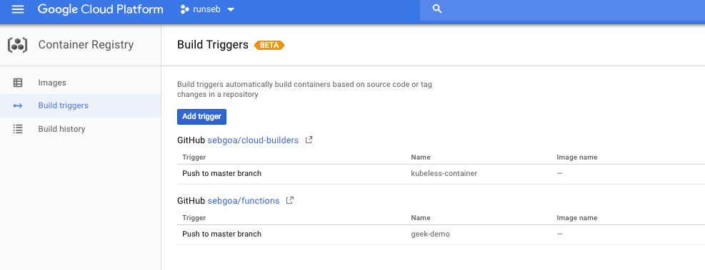
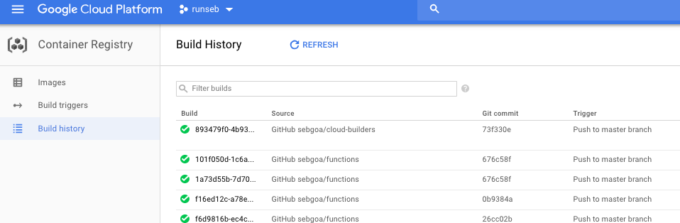

# Continuous Delivery of Functions with Google Container Builder and kubeless on GKE

## Setup
### Create a Kubernetes cluster on GKE

```
gcloud container clusters create foobar --disable-addons HttpLoadBalancing
```

Configure your account to be cluster admin:

```
kubectl create clusterrolebinding functions-cluster-admin --clusterrole=cluster-admin --user=<ACCOUNT_EMAIL>
```

### Install Helm and Deploy an Ingress controller

To expose our functions to the public internet we need to have an `nginx` Ingress controller. You can install it with `helm`.

```
helm init
kubectl create serviceaccount --namespace kube-system tiller
kubectl create clusterrolebinding tiller-cluster-rule --clusterrole=cluster-admin --serviceaccount=kube-system:tiller
kubectl patch deploy --namespace kube-system tiller-deploy -p '{"spec":{"template":{"spec":{"serviceAccount":"tiller"}}}}'      
helm init --service-account tiller --upgrade
```

Now deploy the Ingress controller:

```
helm install --name nginx-ingress stable/nginx-ingress --set rbac.create=true
```

Note the Public IP for the LoadBalancer on which you reach the Ingress controller. Use that IP in your DNS domain configuration.

### Install `kubeless`

```
kubectl create ns kubeless
kubectl create -f https://github.com/kubeless/kubeless/releases/download/v1.0.0-alpha.6/kubeless-v1.0.0-alpha.6.yaml 
```

On your local machine get the `kubeless` CLI

```
brew install kubeless
```

## Create a function and setup your CD.

### Create a function

cat <<EOF > foo.py
def handler(event, context):
    try:
        print(event)
    except:
        pass
    print(event['data'])
    return "Hello World\n"
EOF

### Deploy the function with [Container Builder](https://cloud.google.com/container-builder/)

To deploy the function continuously (i.e on every commit), we can use Google container builder.

To do this we need to write a `cloudbuild.yaml` file which defines our _build steps_

First we define a custom build step which is going to write our Function manifest. To do this we rely on a custom image `runseb/kubeless` which contains the kubeless CLI. We call it via bash in order to properly write the manifest to the container builder temporary workspace.

```
steps:
- name: 'gcr.io/runseb/kubeless'
  entrypoint: 'bash'
  args:
  - '-c'
  - |
    /builder/kubeless.bash function ls
    kubeless function deploy foo --runtime=python3.6 --handler=foo.handler --from-file=foo.py --dry-run > function.yaml
  env:
  - 'CLOUDSDK_COMPUTE_ZONE=us-central1-a'
  - 'CLOUDSDK_CONTAINER_CLUSTER=geek-demo'
```

Second, we run `kubectl apply` via container builder to declaratively apply our function changes to our GKE cluster. Like so:

```
- name: 'gcr.io/cloud-builders/kubectl'
  args: ['apply', '-f', 'function.yaml']
  env:
...
```

NOTE: Replace the ZONE and cluster NAME with yours.

### Define the build trigger



Once you will make commits to your code, container builder will run and you will see every build history:




### Add a function route

Now that your function is deployed continuously, you want to be able to do the same with the function trigger. In this example, we create an http trigger using the `kubeless` CLI again.


``me: 'gcr.io/runseb/kubeless'
  entrypoint: 'bash'
  args:
  - '-c'
  - |
    /builder/kubeless.bash function ls
    kubeless trigger http create foo --hostname func.kubeless.sh --function-name foo --dry-run > trigger.yaml
...
```

NOTE: The hostname needs to be configured in your DNS zone. It should point to the IP address of your `nginx` ingress controller.

Here again, the manifest for the HTTP trigger is generated by the `kubeless` CLI and stored in the container builder workspace. You can then _apply_ it to your GKE cluster.

```
- name: 'gcr.io/cloud-builders/kubectl'
  args: ['apply', '-f', 'trigger.yaml']
...
```

And now enjoy modifying your function and seeing the continuous delivery.

_GitOps_ with Google container builder, GKE and kubeless.
